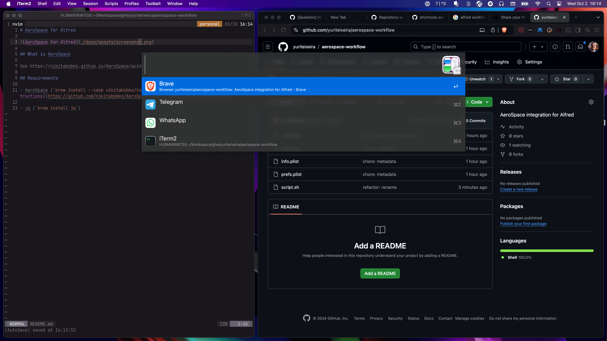

# AeroSpace for Alfred 

## What is AeroSpace

See https://nikitabobko.github.io/AeroSpace/guide

## Requirements

- **AeroSpace** (`brew install --cask nikitabobko/tap/aerospace`, see more in their [install instructions](https://github.com/nikitabobko/AeroSpace?tab=readme-ov-file#installation)

- **Jq** (`brew install jq`)

## How to use

1. Download the workflow from the [releases page](https://github.com/yuriteixeira/aerospace-workflow/releases) and install it by double-clicking the `.alfredworkflow` file.

2. Use the `!aw` (aerospace windows) to list all visible windows and select one to focus. ProTIP™: Set a shortcut like `Cmd + Alt + Ctrl + Space` in the workflow settings to bring the window list up.
